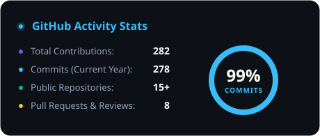
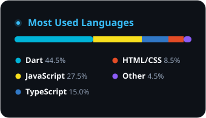

  

<!-- Live Typewriter Animation -->

  <strong>Sumit Khadka</strong> &bull; Kathmandu, Nepal 🇳🇵 
  <em>Final Year Computing Student @ Ithari International Collage &amp; IT</em>

  
  &nbsp;&nbsp;
  
  &nbsp;&nbsp;
  

---

### 👨‍💻 Who Am I

I am a passionate **Flutter Developer** and **Full-Stack Engineer** based in Kathmandu, Nepal. I specialize in building performant, beautiful cross-platform mobile apps with Flutter/Dart and scalable web backends with Node.js, Express, and MongoDB.

- 🎓 **Education:** BSc (Hons) Computing (Final Year) at **Softwarica College of IT &amp; E-Commerce**
- 💼 **Internship:** Flutter Developer Intern at **Bihe Nepal** *(June – August 2026)*
- 🏋️ **Current Focus:** Final Year Project — **Titan Coaching Platform** *(Multi-mode trainer booking platform built with the MERN stack and MongoDB Atlas)*
- 🎯 **Passions:** Clean Architecture, Reactive State Management, and High-Performance UI/UX

---

### 🛠️ Tech Arsenal

**Mobile Development**  

**Web &amp; Backend**  

**Tools &amp; Workflow**  

---

### 📊 Real-Time GitHub Analytics

<!-- Local, Zero-Downtime SVGs Committed Directly in Repo -->

&nbsp;

---

### 🚀 Featured Deployments &amp; Projects

<table>
  <tr>
    <td width="50%" valign="top">
      <h3>🏋️ <a href="https://github.com/khadka-sumit/FYP">Titan Coaching Platform</a></h3>
      
Full-stack trainer booking web application supporting Gym, In-Home, Online &amp; Diet coaching modes with MongoDB Atlas cloud connectivity. Built as Final Year Project.

      

        
        
        
      

    </td>
    <td width="50%" valign="top">
      <h3>🌤️ <a href="https://github.com/khadka-sumit/Flutter-WeatherApp">Flutter Weather App</a></h3>
      
Real-time weather forecast application using OpenWeatherMap API, dynamic Lottie condition animations, Google Fonts, and clean MVCS architecture.

      

        
        
      

    </td>
  </tr>
  <tr>
    <td width="50%" valign="top">
      <h3>🔐 <a href="https://github.com/khadka-sumit/Firebase-Auth-App">Firebase Auth App</a></h3>
      
Complete Flutter mobile authentication with Firebase email/password login, register, password reset, and mapped error codes.

      

        
        
      

    </td>
    <td width="50%" valign="top">
      <h3>🛒 <a href="https://github.com/khadka-sumit/product-listing-app-flutter-">Product Listing App</a></h3>
      
Flutter e-commerce catalog featuring GridView layout, real-time title search filtering, pull-to-refresh, and loading/error/empty state handling.

      

        
        
      

    </td>
  </tr>
</table>

---

### 🤝 Let's Connect &amp; Collaborate

📍 Kathmandu, Nepal &bull; 📧 [sumitkhadka708@gmail.com](mailto:sumitkhadka708@gmail.com)

&nbsp;

&nbsp;

